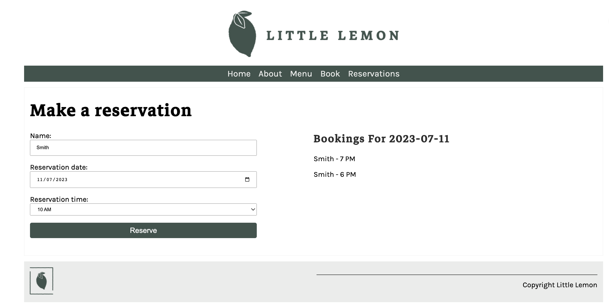
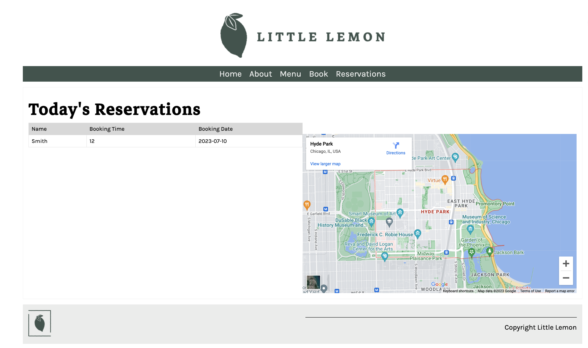

# Meta Back-end Developer Capstone Project

- Django and Django REST Framework: The web application uses Django and Django REST Framework to serve static HTML content and build the API endpoints.

- MySQL Database: The backend is connected to a MySQL database to store and retrieve data.

